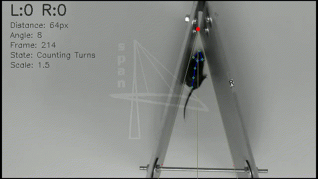

# SPAN Corner Test Kit

A behavioral testing framework for automated analysis of animal behavior in corner tests, leveraging DeepLabCut for pose estimation. This tool provides a command-line interface to watch video analysis in real-time or batch-process videos to generate annotated output videos and CSV reports.




## Requirements

- **Operating System:** Linux (recommended, based on file structure) or Windows (some Windows-specific packages in environment.yml).
- **Python:** 3.8.16
- **Package Manager:** Conda (for environment management).
- **Core Dependencies:**
  - DeepLabCut 2.3.4
  - OpenCV
  - Click (CLI)
  - TensorFlow 2.10.0
  - PySide6 (for GUI elements)
  - NumPy, Pandas, Matplotlib
 
### Input Data Requirements

CTAT expects a single animal to be visible throughout the recording. Videos should provide sufficient spatial resolution to clearly distinguish the animal's head and body orientation. Uniform lighting and adequate contrast between the animal and the background are recommended. The software has been validated on SPAN corner test recordings and may require additional model training for substantially different acquisition setups.

## Setup & Installation

1.  **Clone the repository:**
    ```bash
    git clone https://github.com/aglee-prog/span_corner_test
    cd span_corner_test
    ```

2.  **Create the Conda environment:**
    The project provides two environment files in the `conda_env/` directory.
    ```bash
    conda env create -f conda_env/DEEPLABCUT.yaml
    ```

3.  **Activate the environment:**
    ```bash
    conda activate DEEPLABCUT_KIT
    ```
### Verifying Correct Installation

To verify correct installation, run the software on one of the example videos included in the repository:
```bash
python span-kit.py watch --path data/example.mp4 --model mice
```
Successful execution should display the analyzed video with pose tracking overlays and detected behavioral events. Running the create command should produce an annotated output video and a CSV report containing detected turns and associated metrics.

### Trained Models

The repository includes pretrained DeepLabCut models for both rat and mouse corner test analysis. The desired model can be selected using the --model argument:
```bash
python span-kit.py watch --path video.mp4 --model rats
```
or
```bash
python span-kit.py watch --path video.mp4 --model mice
```
Users working with substantially different recording conditions, species, or experimental setups may need to retrain the DeepLabCut model using their own annotated data.

## Usage

The main entry point is the `span-kit.py` script.

### CLI Commands

The tool uses `click` for its command-line interface.

#### 1. Watch Analysis
To watch the behavior analysis in real-time for a specific video:
```bash
python span-kit.py watch --path /path/to/video.mp4 --model [rats|mice]
```
- `--path`: Path to the input video file.
- `--model`: Select the model to use (`rats` or `mice`). Default is `mice`.

#### 2. Create Reports
To batch-process videos in a directory, generate annotated output videos, and export CSV reports:
```bash
python span-kit.py create --path /path/to/directory_or_video --model [rats|mice]
```
- `--path`: Path to the directory containing `.mp4` files (it will recursively search for videos) or a specific video file.
- `--model`: Select the model to use (`rats` or `mice`). Default is `mice`.

Annotated videos will be saved with an `-output.mp4` suffix. CSV reports will be saved in the same directory with a timestamped filename (e.g., `report_Oct_31_2025_02_16span.csv`).

## Project Structure

- `span-kit.py`: Main CLI entry point.
- `behaviour_tests/`: Contains specific behavioral test implementations.
    - `corner_ext/`: Corner test extension logic, models, and processors.
    - `common/`: Shared processors and themes.
- `classes/`: Core framework classes (Factory, Process, DataExtractors, etc.).
- `conda_env/`: Conda environment configuration files.
- `data/`: Sample input videos and generated reports.
- `utils/`: Common utility functions.
- `assets/`: Project assets like logos.

## Troubleshooting

### TensorFlow cannot detect GPU
Verify that the installed CUDA and TensorFlow versions are compatible.

### DLC model not found
Ensure that the trained model files are present in the expected model directory.

### No turns detected
Verify that the correct species model (rats or mice) was selected and that the animal remains visible throughout the recording.

## License

This project is primarily licensed under the GNU Lesser General Public License v3.0. Note that the software is provided “as is”, without warranty of any kind, express or implied.

